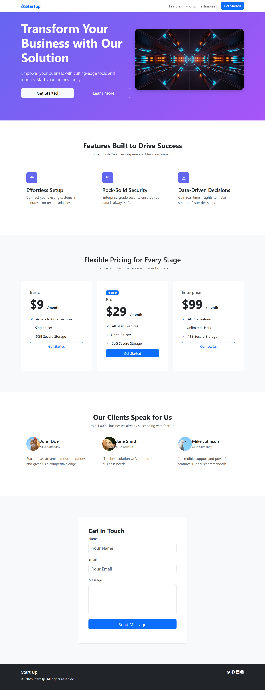

# 🚀 Startup Landing Page – Bootstrap 5 Practice Project

A responsive, modern landing page for a startup, built using **HTML**, **Bootstrap 5**, and **custom CSS**.

---

## 🎯 Project Highlights

✅ Responsive **navbar** with collapse behavior  
✅ Attention-grabbing **hero section** with clear CTAs  
✅ Informative **features section** using Bootstrap Icons  
✅ Structured **pricing cards** with “Get Started” buttons  
✅ Authentic **testimonial cards**  
✅ **Contact form** layout with Bootstrap-ready validation styles  
✅ Clean **footer** with social media icons

---

## 🛠️ Built With

| Technology       | Description                                      |
|------------------|--------------------------------------------------|
| HTML5            | SEO friendly markup                                              |
| Bootstrap 5       | Layout, utilities, and responsive components     |
| Bootstrap Icons   | Modern iconography                       |
| Custom CSS        | Enhancements, hover animations, color styling   |

---

## 📸 Demo



---

## 🔗 Live Demo

Try it yourself at:  
👉 https://harshaweb09.github.io/bootstrap-landingpage/

---

## 📥 Feel free to clone and explore the code

1. Clone the repo:  
   ```bash
   git clone https://github.com/harshaweb09/bootstrap-landingpage.git
2. Navigate to the project folder:
   ```bash
   cd bootstrap-landingpage
3. Open the index.html file in your browser to view the landing page locally:
   ```bash
   ./index.html
